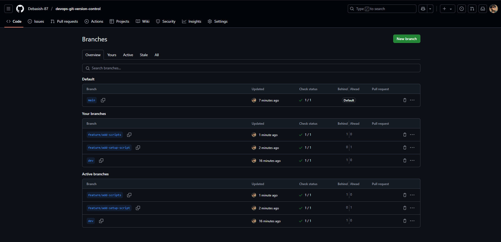
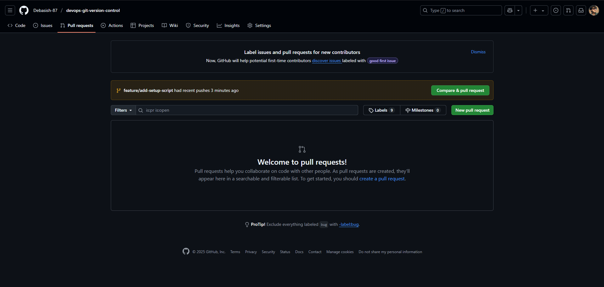
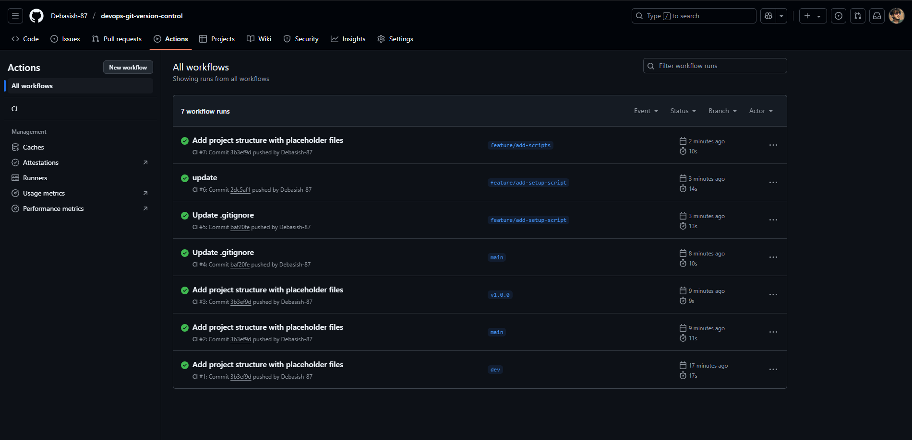
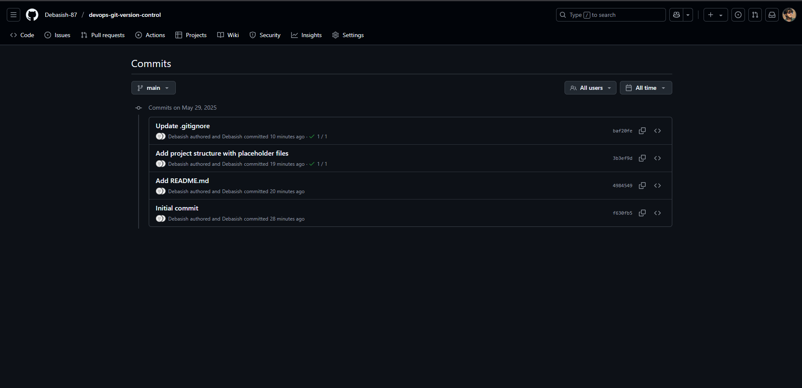
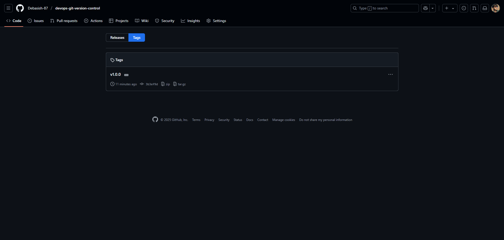

# devops-git-version-control

A Git version control practices project created for the DevOps internship task.  
This project demonstrates best practices in managing a DevOps project using Git, including branching strategies, pull requests, tagging, and CI integration.

---

## Table of Contents

- [Project Overview](#project-overview)
- [Features](#features)
- [Directory Structure](#directory-structure)
- [Getting Started](#getting-started)
- [Branching Strategy](#branching-strategy)
- [Continuous Integration (CI)](#continuous-integration-ci)
- [Contributing](#contributing)
- [License](#license)
- [Contact](#contact)

---

## Project Overview

This repository aims to help you learn and implement version control workflows effectively in a DevOps environment. It includes practical examples of Git commands, branching workflows, and automation using GitHub Actions.

---

## Features

- Git branching: `main`, `dev`, and `feature/*` branches  
- Use of pull requests (PRs) for merging code  
- Semantic versioning with Git tags  
- GitHub Actions for Continuous Integration (CI)  
- Documentation of Git workflows and commands  
- Proper `.gitignore` management

---

## Directory Structure

```

devops-git-version-control/
├── .gitignore
├── README.md
├── scripts/
│   └── setup.sh
├── docs/
│   └── git-workflows.md
├── examples/
│   └── sample-git-commands.txt
└── .github/
└── workflows/
└── ci.yml

````

- `scripts/` — contains automation scripts  
- `docs/` — documentation related to Git workflows  
- `examples/` — sample Git command usage examples  
- `.github/workflows/` — GitHub Actions workflow configuration  

---

## Getting Started

### Prerequisites

- Git installed on your system  
- A GitHub account  

### Clone the Repository

```bash
git clone https://github.com/Debasish-87/devops-git-version-control.git
cd devops-git-version-control
````

---

## Branch Usage

* Work on `dev` branch for ongoing development
* Create feature branches off `dev` for new features/fixes
* Use pull requests to merge changes to `dev` and then to `main`

---

## Branching Strategy

| Branch      | Purpose                             |
| ----------- | ----------------------------------- |
| `main`      | Production-ready code               |
| `dev`       | Integration and ongoing development |
| `feature/*` | Feature-specific branches off `dev` |

Pull requests are required to merge `feature/*` branches into `dev`, and `dev` into `main`.

---

## Continuous Integration (CI)

This project uses GitHub Actions to automate builds and checks on each push or pull request.

Workflow file: `.github/workflows/ci.yml`

---

## Screenshots

### Branches


### Pull Request


### GitHub Actions


### Commits


### Release Tags



📚 Interview Questions – Prepare Answers For:
---

### 1. **What is Git?**

Git is a **distributed version control system** that helps track changes in source code during software development. It allows multiple developers to collaborate, manage code versions, and revert changes when needed.

---

### 2. **Difference between merge and rebase**

* **Merge**: Combines changes from one branch into another and creates a **merge commit**. Preserves the commit history.
* **Rebase**: Moves or reapplies commits from one branch on top of another. It creates a **linear history**, but rewrites commit hashes.

> Use **merge** for collaboration and **rebase** for clean history.

---

### 3. **What is a pull request?**

A pull request (PR) is a **request to merge changes** from one branch into another (often from `feature/*` → `dev`, or `dev` → `main`) on platforms like GitHub. It allows **code review**, **discussion**, and **automated checks** before merging.

---

### 4. **How do you resolve merge conflicts?**

* Identify conflicted files (Git will mark them).
* Open the files and **manually fix the conflicts**.
* Stage the resolved files: `git add <filename>`
* Commit the resolution: `git commit`

> Conflicts happen when two branches change the same part of a file.

---

### 5. **What are Git tags?**

Tags are used to **mark specific points in history**, often for **releases (e.g., v1.0.0)**. They are like bookmarks and are **not updated** like branches.

* Lightweight Tag: Just a pointer
* Annotated Tag: Includes metadata (author, date, message)

---

### 6. **What is Git workflow?**

Git workflow is a **set of rules or practices** for using Git branches effectively. Examples include:

* **Feature Branch Workflow**
* **Git Flow**
* **GitHub Flow**

> Your project uses: `main`, `dev`, `feature/*` → standard feature branch workflow.

---

### 7. **Explain `git stash`**

`git stash` temporarily **saves uncommitted changes** (tracked files) so you can switch branches or pull changes without losing work.
Use `git stash pop` to reapply the changes later.

---

### 8. **Purpose of `.gitignore`**

`.gitignore` tells Git **which files/folders to ignore**. Common uses:

* Ignore OS files (`.DS_Store`)
* Ignore build artifacts (`node_modules`, `__pycache__`)
* Keep the repo clean and lightweight

---

## Contributing

Feel free to fork the repository and submit pull requests. Please follow the branching strategy and write clear commit messages.

---

## License

This project is licensed under the MIT License. See the LICENSE file for details.

---

## Contact

**Debasish Mohanty**
GitHub: [https://github.com/Debasish-87](https://github.com/Debasish-87)
Email: ([your.email@example.com](mailto:your.email@example.com)) *(optional)*

---

Happy Git branching and merging! 🚀

```
